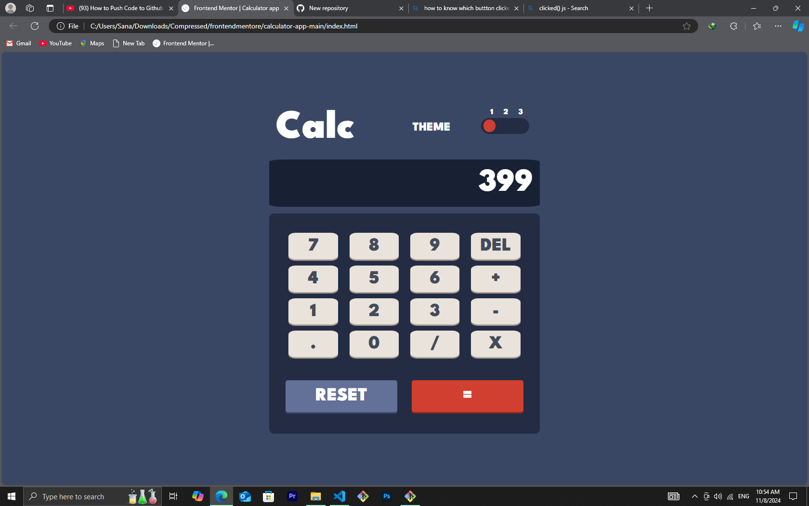
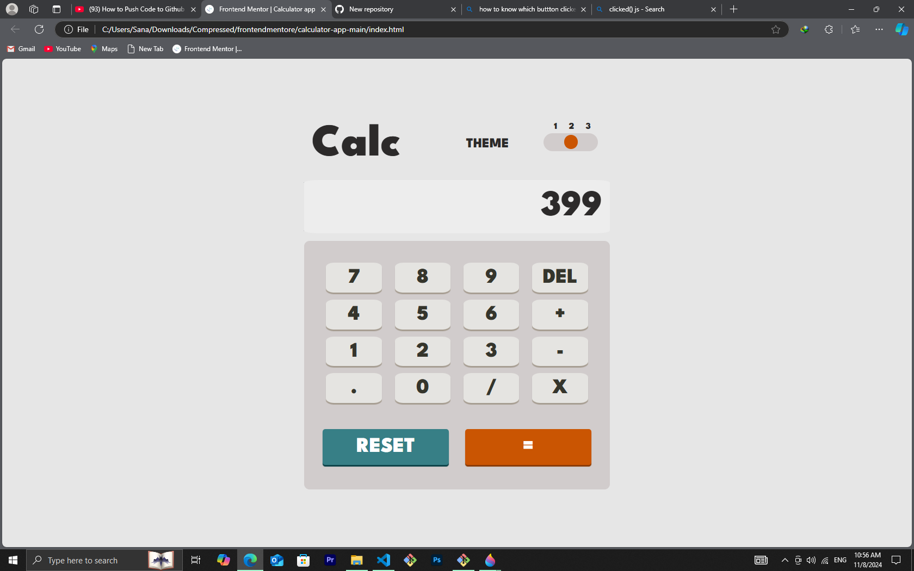
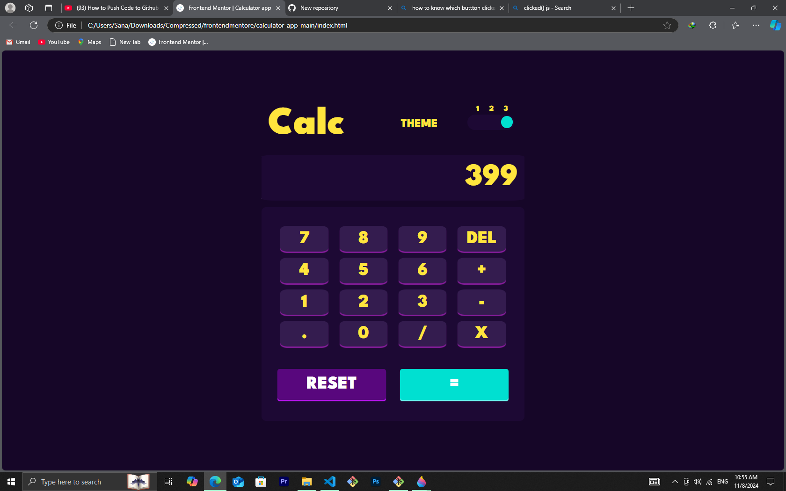

# Frontend Mentor - Calculator app solution

This is a solution to the [Calculator app challenge on Frontend Mentor](https://www.frontendmentor.io/challenges/calculator-app-9lteq5N29). Frontend Mentor challenges help you improve your coding skills by building realistic projects.

## Table of contents

- [Overview](#overview)
  - [The challenge](#the-challenge)
  - [Screenshot](#screenshot)
  - [Links](#links)
- [My process](#my-process)
  - [Built with](#built-with)
  - [What I learned](#what-i-learned)
  - [Continued development](#continued-development)
  - [Useful resources](#useful-resources)
- [Author](#author)
- [Acknowledgments](#acknowledgments)

## Overview

### The challenge

Users should be able to:

- See the size of the elements adjust based on their device's screen size
- Perform mathmatical operations like addition, subtraction, multiplication, and division
- Adjust the color theme based on their preference
- **Bonus**: Have their initial theme preference checked using `prefers-color-scheme` and have any additional changes saved in the browser

### Screenshot

### Links

- Solution URL: [Add solution URL here](https://tm-calculator-app-front-end-mentor.netlify.app/)

## My process

### Built with

- Semantic HTML5 markup
- CSS custom properties
- Flexbox
- CSS Grid
- javaScript

### What I learned

To give life for the application is much difficalt for me, since im not good at javaScript yet. But it was interesting and i am able to learn more from JS.

### Continued development

I want to continue to areas like JS(NATIVE).

### Useful resources

- [Example resource 1](https://www.w3schools.com/) - This helped me for finding JS methods.

## Author

- Website - [Add your name here](https://tamesociallink-4.netlify.app/)
- Frontend Mentor - [@tamratmelese](https://www.frontendmentor.io/profile/tamratmelese)

## Acknowledgments

THANK GOD!!
and all friends on youtube and resources like Mozilla Developer, W3Shoole..
